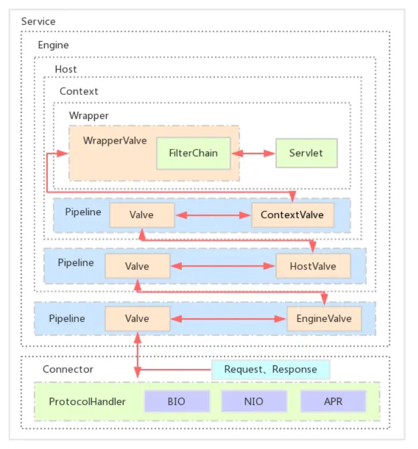
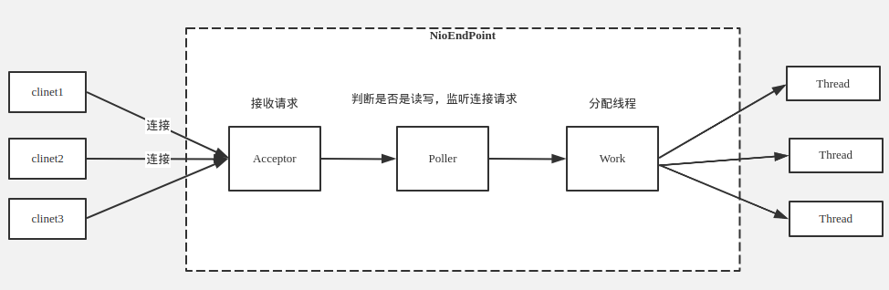
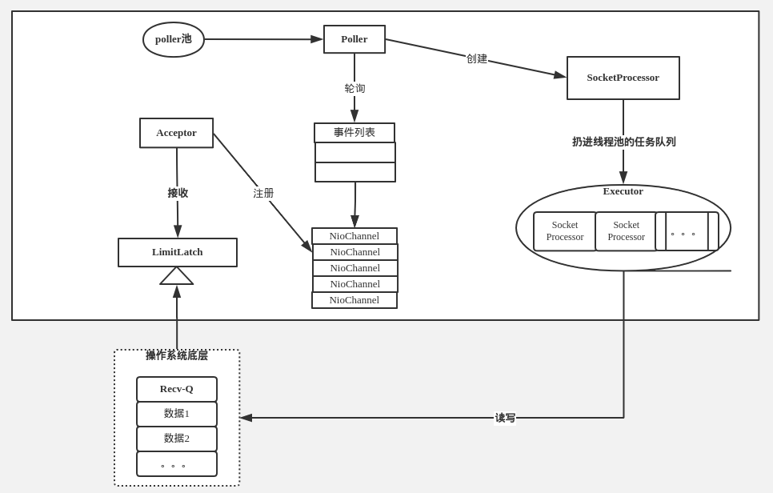

# Tomcat启动原理

目标：

+ Tomcat服务器启动原理

+ Tomcat加载用户Web服务的原理
+ 请求接入与处理流程分析

## 下载源码搭建测试服务

由catalina.sh（输出调试信息set -x）

```shell
eval "/usr/bin/java" 
"-Djava.util.logging.config.file=/opt/apache-tomcat-8.5.54/conf/logging.properties" 
-Djava.util.logging.manager=org.apache.juli.ClassLoaderLogManager  
-Djdk.tls.ephemeralDHKeySize=2048 
-Djava.protocol.handler.pkgs=org.apache.catalina.webresources 
-Dorg.apache.catalina.security.SecurityListener.UMASK=0027  
-Dignore.endorsed.dirs="" 
-classpath "/opt/apache-tomcat-8.5.54/bin/bootstrap.jar:/opt/apache-tomcat-8.5.54/bin/tomcat-juli.jar" 
-Dcatalina.base="/opt/apache-tomcat-8.5.54" 
-Dcatalina.home="/opt/apache-tomcat-8.5.54" 
-Djava.io.tmpdir="/opt/apache-tomcat-8.5.54/temp" 
org.apache.catalina.startup.Bootstrap start &
```

启动类：

`org.apache.catalina.startup.Bootstrap`，

参数：

`start`。

JVM参数(按上面提示调整)：

```
-Dcatalina.home="/home/lee/mywork/java/web-server/apache-tomcat-8.5.38-src"
-Dcatalina.base="/home/lee/mywork/java/web-server/apache-tomcat-8.5.38-src"
-Djava.endorsed.dirs="/home/lee/mywork/java/web-server/apache-tomcat-8.5.38-src/endorsed"
-Djava.util.logging.manager=org.apache.juli.ClassLoaderLogManager
-Djava.util.logging.config.file=/home/lee/mywork/java/web-server/apache-tomcat-8.5.38-src/conf/logging.properties
```

## Tomcat服务器启动原理

### Tomcat服务器组件架构


+ **Server**

  整个 Tomcat 服务器，包含多组服务，负责管理和启动各个Service，同时监听 8005 端口发过来的 shutdown 命令。

  + **Listener**（可多个）

  + **GlobalNamingResources**

  + **JNDI**

  + **Service**(可多个)

    Tomcat封装的、对外提供完整的、基于组件的 web 服务。

    + **Connector**

    + **Executor**

    + **Engine**

      Servlet顶层容器。

      + **Listener**

      + Cluster

      + **Realm**

      + **Host**

        虚拟主机，负责 web 应用的部署和 Context 的创建。

        + **Listener**

        + Cluster

        + **Realm**

        + **Context**

          Web 应用上下文，包含多个 Wrapper，负责 web 配置的解析、管理所有的 Web 资源。

          + **Listener**
          + **Realm**
          + **WebApp**
          + **ResourceLink**
          + **Resource**
          + **Manager**
          + **Loader**

### Catalina.sh启动脚本

主要是找源码的启动入口

```shell
eval \{ $_NOHUP "\"$_RUNJAVA\"" "\"$LOGGING_CONFIG\"" $LOGGING_MANAGER $JAVA_OPTS $CATALINA_OPTS \
      -D$ENDORSED_PROP="\"$JAVA_ENDORSED_DIRS\"" \
      -classpath "\"$CLASSPATH\"" \
      -Dcatalina.base="\"$CATALINA_BASE\"" \
      -Dcatalina.home="\"$CATALINA_HOME\"" \
      -Djava.io.tmpdir="\"$CATALINA_TMPDIR\"" \
      org.apache.catalina.startup.Bootstrap "$@" start \
      2\>\&1 \&\& echo \$! \>\"$catalina_pid_file\" \; \} $catalina_out_command "&"
```

由上面可知源码启动类：`org.apache.catalina.startup.Bootstrap`，参数`start`。

### 启动代码分析

```java
Bootstrap$main()
  Bootstrap bootstrap = new Bootstrap();
	//创建３个类加载器，把catalinaLoader赋值给当前上下文类加载器（就是为了破坏双亲委派加载tomcat servlet相关实现类）
	//使用catalinaLoader加载org.apache.catalina.startup.Catalina，并创建实例
	//反射调用Catalina的setParenetClassLoader
  bootstrap.init();
    initClassLoaders();
    Thread.currentThread().setContextClassLoader(catalinaLoader);
    Object startupInstance = startupClass.getConstructor().newInstance();
    method.invoke(startupInstance, paramValues);
    catalinaDaemon = startupInstance;
  daemon = bootstrap;

  //解析命令并执行,默认为"start"
  daemon.load(args);
	//反射调用Catalina$load()
	//主要就是从xml配置文件，启动参数中读取配置
	method.invoke(catalinaDaemon, param);	//Catalina$load()
	  digester.parse(inputSource);
	  getServer().setCatalina(this);
      getServer().setCatalinaHome(Bootstrap.getCatalinaHomeFile());
      getServer().setCatalinaBase(Bootstrap.getCatalinaBaseFile());
 	  getServer().init();
		initInternal();	//StandardServer$initInternal()
		  for {
            //一个service想当于一个独立的web应用，使用一个线程池承载内部的web服务
            services[i].init();	//StandService$initInternal()
              //******************************************************
              //engine初始化，创建线程池
              engine.init();	
                //使用阻塞队列，创建核心线程和最大线程数都为1（从配置文件读取的配置，不设置则默认为１）、线程空闲存活10s的线程池
              	BlockingQueue<Runnable> startStopQueue = new LinkedBlockingQueue<>();
                startStopExecutor = new ThreadPoolExecutor(
                        getStartStopThreadsInternal(),
                        getStartStopThreadsInternal(), 10, TimeUnit.SECONDS,
                        startStopQueue,
                        new StartStopThreadFactory(getName() + "-startStop-"));
                startStopExecutor.allowCoreThreadTimeOut(true);
        		super.initInternal();
              //******************************************************
              for{
                //这个是连接器用于处理连接的线程池
                executor.init();
              }
              //******************************************************
              mapperListener.init();
              //******************************************************
              for{
                connector.init();	//Connector$initInternal()
                  protocolHandler.init();
                    endpoint.init();	//AbstractEndpoint$init()
                   	  //创建Nio，绑定0.0.0.0:8088 SocketChannel
                  	  //配置阻塞模式
                  	  bind();			//NioEndPoint$bind()
                  		serverSock = ServerSocketChannel.open();
                        socketProperties.setProperties(serverSock.socket());
                        InetSocketAddress addr = (getAddress()!=null?new InetSocketAddress(getAddress(),getPort()):new InetSocketAddress(getPort()));
                        serverSock.socket().bind(addr,getAcceptCount());
                  		//启动监听和处理
                  		selectorPool.open();
              }
          }

  daemon.start();
	method.invoke(catalinaDaemon, (Object [])null);	//Catalina$start()
	  getServer().start();
		for{
          services[i].start()
            //******************************************************
            engine.start()	//StandardEngine$startInternal()
              ((Lifecycle) realm).start();
              Container children[] = findChildren();
              for{
                //线程池（这个线程池默认就只有一个线程）中启动Host子容器
                results.add(startStopExecutor.submit(new StartChild(children[i])));
                  //后面的处理都是在这个线程池的线程中执行
                  child.start();	//ContainerBase#StartChild$call()
                //等待任务提交完毕
                for{
                  result.get();
                }
              }
            　//TODO: 猜想这个是用于Connector和Host之间通信的
              ((Lifecycle) pipeline).start();
            	init() 	//StandardPipeline$initInternal()
                startInternal()	//StandardPipeline$startInternal()
                  while{
                    //只是修改了下状态
                    ((Lifecycle) current).start();	//current是StandardEngineValve实例
                  }
         	  threadStart();
            	//ContainerBackgroundProcessor用于处理Context处理
                thread = new Thread(new ContainerBackgroundProcessor(), threadName);
                thread.setDaemon(true);
                thread.start();
            //******************************************************
            for{
              //启动连接池???
              executor.start();
                //
                executor = new ThreadPoolExecutor(getMinSpareThreads(), getMaxThreads(), maxIdleTime, TimeUnit.MILLISECONDS,taskqueue, tf);
                executor.prestartAllCoreThreads();
            }
            //******************************************************
            mapperListener.start();
              Engine engine = service.getContainer();
              findDefaultHost();
              //注册路由
              addListeners(engine);
              Container[] conHosts = engine.findChildren();
              for{
                //注册后台请求处理
                registerHost(host);
              }
            //******************************************************
            for{
              connector.start();
                endpoint.start();	//AbastractProtocol
                  //接上了之前NIO
                  initializeConnectionLatch();
                  pollers = new Poller[getPollerThreadCount()];
                  for (int i=0; i<pollers.length; i++) {
                    pollers[i] = new Poller();
                    Thread pollerThread = new Thread(pollers[i], getName() + "-ClientPoller-"+i);
                    pollerThread.setPriority(threadPriority);
                    pollerThread.setDaemon(true);
                    pollerThread.start();
                      //
                      selector.select(selectorTimeout);
                  }
                  startAcceptorThreads();
            }
        }
  await();
	//每10s秒查看一下server状态，直到stopAwait=true后退出。
	getServer().await();
  stop();
```

重要的对象：

+ bootstrap

+ daemon/catalinaDaemon

  Tomcat服务器实例。

#### 配置解析

```java
Catalina$load()
```

#### 连接池NIO处理请求解析

Tomcat这部分实现代码抽离到request-handle模块。







流程简介：

1、用户点击网页内容，请求被发送到本机端口8080，被在那里监听的Coyote HTTP/1.1 Connector获得。

2、Connector把该请求交给它所在的Service的Engine来处理，并等待Engine的回应。 

3、Engine获得请求localhost/test/index.jsp，匹配所有的虚拟主机Host。 

4、Engine匹配到名为localhost的Host（即使匹配不到也把请求交给该Host处理，因为该Host被定义为该Engine的默认主机），名为localhost的Host获得请求/test/index.jsp，匹配它所拥有的所有的Context。Host匹配到路径为/test的Context（如果匹配不到就把该请求交给路径名为“ ”的Context去处理）。 

5、path=“/test”的Context获得请求/index.jsp，在它的mapping table中寻找出对应的Servlet。Context匹配到URL PATTERN为*.jsp的Servlet,对应于JspServlet类。 

6、构造HttpServletRequest对象和HttpServletResponse对象，作为参数调用JspServlet的doGet（）或doPost（）.执行业务逻辑、数据存储等程序。 

7、Context把执行完之后的HttpServletResponse对象返回给Host。 

8、Host把HttpServletResponse对象返回给Engine。 

9、Engine把HttpServletResponse对象返回Connector。 

10、Connector把HttpServletResponse对象返回给客户Browser。

源码解析：

+ Connector 
  + ProtocolHandler
  + Adapter

#### Valve请求过滤

#### ContainerBackgroundProcessor通过Context处理请求

## Tomcat加载用户Web服务原理

入口：`ContextConfig$webConfig()`


