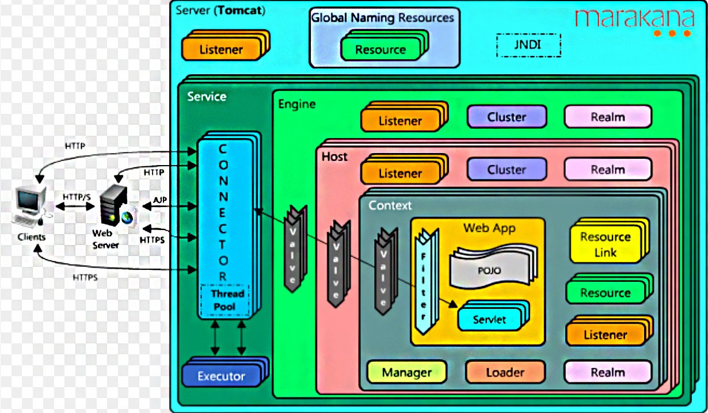

# Tomcat配置文件详解

## Tomcat配置文件简介

- catalina.policy: Tomcat安全策略文件,控制JVM相关权限,具体可以参考java. security.Permission
- catalina.properties : Tomcat Catalina行为控制配置文件,比如Common ClassLoader
- logging.properties  : Tomcat日志配置文件, JDK Logging
- **server.xml** : Tomcat Server配置文件
- GlobalNamingResources :全局JNDI资源
- context.xml :全局Context配置文件
- tomcat-users.xml : Tomcat角色配置文件
- **web.xml** : Servlet标准的web.xml部署文件, Tomcat默认实现部分配置入内:
  - org.apache.catalina.servlets.DefaultServlet
  - org.apache.jasper.servlet.JspServlet

## 配置文件详解

+ server.xml

  
  
  server.xml配置文件的层次结构和架构图是一样的。
  
  ```xml
  <?xml version="1.0" encoding="UTF-8"?>
  
  <!--Server标签对应Tomcat物理服务器
      常用属性：
      port：Tomcat监听shutdown命令的端口。
      shutdown：通过指定的端口（port）关闭Tomcat所需的字符串。修改shutdown的值，对shutdown.bat无影响-->
  <Server port="8005" shutdown="SHUTDOWN">
  
    <!--Listener即监听器，负责监听特定的事件，当特定事件触发时，Listener会捕捉到该事件，并做出相应处理。
        Listener通常用在Tomcat的启动和关闭过程。Listener可嵌在Server、Engine、Host、Context内。
        常用属性：
          　　className：指定实现org.apache.catalina.LifecycleListener接口的类-->
    <Listener className="org.apache.catalina.startup.VersionLoggerListener" />
    <!-- Security listener. Documentation at /docs/config/listeners.html
    <Listener className="org.apache.catalina.security.SecurityListener" />
    -->
    <!--APR library loader. Documentation at /docs/apr.html -->
    <!--<Listener className="org.apache.catalina.core.AprLifecycleListener" SSLEngine="on" />-->
    <!-- Prevent memory leaks due to use of particular java/javax APIs-->
    <Listener className="org.apache.catalina.core.JreMemoryLeakPreventionListener" />
    <Listener className="org.apache.catalina.mbeans.GlobalResourcesLifecycleListener" />
    <Listener className="org.apache.catalina.core.ThreadLocalLeakPreventionListener" />
  
    <!-- Global JNDI resources
         Documentation at /docs/jndi-resources-howto.html
    -->
    <!--用于配置JNDI-->
    <GlobalNamingResources>
      <!-- Editable user database that can also be used by
           UserDatabaseRealm to authenticate users
      -->
      <Resource name="UserDatabase" auth="Container"
                type="org.apache.catalina.UserDatabase"
                description="User database that can be updated and saved"
                factory="org.apache.catalina.users.MemoryUserDatabaseFactory"
                pathname="conf/tomcat-users.xml" />
    </GlobalNamingResources>
  
    <!-- A "Service" is a collection of one or more "Connectors" that share
         a single "Container" Note:  A "Service" is not itself a "Container",
         so you may not define subcomponents such as "Valves" at this level.
         Documentation at /docs/config/service.html
     -->
    <!--包装Executor、Connector、Engine，以组成一个完整的服务， Server可以包含多个Service组件。
        常用属性：
          className：指定实现org.apache.catalina. Service接口的类，默认值为org.apache.catalina.core.StandardService
          name：Service的名字-->
    <Service name="Catalina">
  
      <!--The connectors can use a shared executor, you can define one or more named thread pools-->
      <!--Service提供的线程池，供Service内各组件使用
          常用属性：
          className：指定实现org.apache.catalina. Executor接口的类，默认值为org.apache.catalina.core. StandardThreadExecutor
          name：线程池的名字
          daemon：是否为守护线程，默认值为true
          maxIdleTime：总线程数高于minSpareThreads时，空闲线程的存活时间（单位：ms），默认值为60000，即1min
          maxQueueSize：任务队列上限，默认值为Integer.MAX_VALUE(（2147483647），超过此值，将拒绝
          maxThreads：线程池内线程数上限，默认值为200
          minSpareThreads：线程池内线程数下限，默认值为25
          namePrefix：线程名字的前缀。线程名字通常为namePrefix+ threadNumber
          prestartminSpareThreads：是否在Executor启动时，就生成minSpareThreads个线程。默认为false
          threadPriority：Executor内线程的优先级，默认值为5（Thread.NORM_PRIORITY）
          threadRenewalDelay：重建线程的时间间隔。重建线程池内的线程时，为了避免线程同时重建，每隔threadRenewalDelay（单位：ms）重建一个线程。默认值为1000，设置为负则不重建
      -->
      <Executor name="tomcatThreadPool" namePrefix="catalina-exec-Fox"
                prestartminSpareThreads="true"     maxThread="200"
                maxThreads="500" minSpareThreads="8"  maxIdleTime="10000"/>
  
  
      <!-- A "Connector" represents an endpoint by which requests are received
           and responses are returned. Documentation at :
           Java HTTP Connector: /docs/config/http.html
           Java AJP  Connector: /docs/config/ajp.html
           APR (HTTP/AJP) Connector: /docs/apr.html
           Define a non-SSL/TLS HTTP/1.1 Connector on port 8080
      -->
      <!--Connector是Tomcat接收请求的入口，每个Connector有自己专属的监听端口；Connector有两种：HTTP Connector和AJP Connector；
          常用属性：
          port：Connector接收请求的端口
          protocol：Connector使用的协议（HTTP/1.1或AJP/1.3）
          connectionTimeout：每个请求的最长连接时间（单位：ms）
          redirectPort：处理http请求时，收到一个SSL传输请求，该SSL传输请求将转移到此端口处理
          executor：指定线程池，如果没设置executor，可在Connector标签内设置maxThreads（默认200）、minSpareThreads（默认10）
          acceptCount：Connector请求队列的上限。默认为100。当该Connector的请求队列超过acceptCount时，将拒绝接收请求
          maxThreads:  最大并发数，默认设置 200  业务线程
          minSpareThreads:  Tomcat初始化时创建的线程数，默认设置 10
          maxConnections：与tomcat建立的最大socket连接数，默认10000-->
      <Connector port="8088" protocol="HTTP/1.1"  executor="tomcatThreadPool"
                 connectionTimeout="20000"  maxThread="200"
                 redirectPort="8443" />
      <!-- A "Connector" using the shared thread pool-->
      <!--
      <Connector executor="tomcatThreadPool"
                 port="8080" protocol="HTTP/1.1"
                 connectionTimeout="20000"
                 redirectPort="8443" />
      -->
      <!-- Define a SSL/TLS HTTP/1.1 Connector on port 8443
           This connector uses the NIO implementation. The default
           SSLImplementation will depend on the presence of the APR/native
           library and the useOpenSSL attribute of the
           AprLifecycleListener.
           Either JSSE or OpenSSL style configuration may be used regardless of
           the SSLImplementation selected. JSSE style configuration is used below.
      -->
      <!--<Connector port="8443" protocol="org.apache.coyote.http11.Http11NioProtocol"
                 maxThreads="150" SSLEnabled="true">
          <SSLHostConfig>
              <Certificate certificateKeystoreFile="conf/localhost-rsa.jks"
                           type="RSA" />
          </SSLHostConfig>
      </Connector>-->
      <!-- Define a SSL/TLS HTTP/1.1 Connector on port 8443 with HTTP/2
           This connector uses the APR/native implementation which always uses
           OpenSSL for TLS.
           Either JSSE or OpenSSL style configuration may be used. OpenSSL style
           configuration is used below.
      -->
      <!--
      <Connector port="8443" protocol="org.apache.coyote.http11.Http11AprProtocol"
                 maxThreads="150" SSLEnabled="true" >
          <UpgradeProtocol className="org.apache.coyote.http2.Http2Protocol" />
          <SSLHostConfig>
              <Certificate certificateKeyFile="conf/localhost-rsa-key.pem"
                           certificateFile="conf/localhost-rsa-cert.pem"
                           certificateChainFile="conf/localhost-rsa-chain.pem"
                           type="RSA" />
          </SSLHostConfig>
      </Connector>
      -->
  
      <!-- Define an AJP 1.3 Connector on port 8009 -->
      <!--<Connector port="8009" protocol="AJP/1.3" redirectPort="8443" />-->
  
  
      <!-- An Engine represents the entry point (within Catalina) that processes
           every request.  The Engine implementation for Tomcat stand alone
           analyzes the HTTP headers included with the request, and passes them
           on to the appropriate Host (virtual host).
           Documentation at /docs/config/engine.html -->
  
      <!-- You should set jvmRoute to support load-balancing via AJP ie :
      <Engine name="Catalina" defaultHost="localhost" jvmRoute="jvm1">
      -->
      <!--Engine负责处理Service内的所有请求。它接收来自Connector的请求，并决定传给哪个Host来处理，Host处理完请求后，将结果返回给Engine，Engine再将结果返回给Connector。
          常用属性：
          name：Engine的名字
          defaultHost：指定默认Host。Engine接收来自Connector的请求，然后将请求传递给defaultHost，defaultHost 负责处理请求
          className：指定实现org.apache.catalina. Engine接口的类，默认值为org.apache.catalina.core. StandardEngine
          backgroundProcessorDelay：Engine及其部分子组件（Host、Context）调用backgroundProcessor方法的时间间隔。
                    若为负，将不调用backgroundProcessor。backgroundProcessorDelay的默认值为10。 Tomcat启动后，Engine、Host、Context会启动一个后台线程，定期调用backgroundProcessor方法。
                    backgroundProcessor方法主要用于重新加载Web应用程序的类文件和资源、扫描Session过期。
          jvmRoute：Tomcat集群节点的id。部署Tomcat集群时会用到该属性，Service内必须包含一个Engine组件；Service包含一个或多个Connector组件，Service内的Connector共享一个Engine-->
      <Engine name="Catalina" defaultHost="localhost">
  
        <!--For clustering, please take a look at documentation at:
            /docs/cluster-howto.html  (simple how to)
            /docs/config/cluster.html (reference documentation) -->
        <!--
        <Cluster className="org.apache.catalina.ha.tcp.SimpleTcpCluster"/>
        -->
  
        <!-- Use the LockOutRealm to prevent attempts to guess user passwords
             via a brute-force attack -->
        <!--Realm可以理解为包含用户、密码、角色的”数据库”。
            Tomcat定义了多种Realm实现：JDBC Database Realm、DataSource Database Realm、JNDI Directory Realm、UserDatabase Realm等-->
        <Realm className="org.apache.catalina.realm.LockOutRealm">
          <!-- This Realm uses the UserDatabase configured in the global JNDI
               resources under the key "UserDatabase".  Any edits
               that are performed against this UserDatabase are immediately
               available for use by the Realm.  -->
        <Realm className="org.apache.catalina.realm.UserDatabaseRealm"
                 resourceName="UserDatabase"/>
        </Realm>
  
        <!--Host负责管理一个或多个Web项目，
          常用属性：
          name：Host的名字
          appBase：存放Web项目的目录（绝对路径、相对路径均可）
          unpackWARs：当appBase下有WAR格式的项目时，是否将其解压（解成目录结构的Web项目）。设成false，则直接从WAR文件运行Web项目
          autoDeploy：是否开启自动部署。设为true，Tomcat检测到appBase有新添加的Web项目时，会自动将其部署
          startStopThreads：线程池内的线程数量。Tomcat启动时，Host提供一个线程池，用于部署Web项目，startStopThreads为0，并行线程数=系统CPU核数；startStopThreads为负数，并行线程数=系统CPU核数+startStopThreads，如果（系统CPU核数+startStopThreads）小于1，并行线程数设为1；startStopThreads为正数，并行线程数= startStopThreads，startStopThreads默认值为1
          startStopThreads为默认值时，Host只提供一个线程，用于部署Host下的所有Web项目。如果Host下的Web项目较多，由于只有一个线程负责部署这些项目，因此这些项目将依次部署，最终导致Tomcat的启动时间较长。此时，修改startStopThreads值，增加Host部署Web项目的并行线程数，可降低Tomcat的启动时间
          -->
        <Host name="localhost"  appBase="webapps"
              unpackWARs="true" autoDeploy="true">
  
          <!-- SingleSignOn valve, share authentication between web applications
               Documentation at: /docs/config/valve.html -->
          <!--
          <Valve className="org.apache.catalina.authenticator.SingleSignOn" />
          -->
  
          <!-- Access log processes all example.
               Documentation at: /docs/config/valve.html
               Note: The pattern used is equivalent to using pattern="common" -->
          <!--Valve可以理解为Tomcat的拦截器，而我们常用filter为项目内的拦截器。Valve可以用于Tomcat的日志、权限等。Valve可嵌在Engine、Host、Context内。-->
          <Valve className="org.apache.catalina.valves.AccessLogValve" directory="logs"
                 prefix="localhost_access_log" suffix=".txt"
                 pattern="%h %l %u %t &quot;%r&quot; %s %b" />
  
          <!--Context代表一个运行在Host上的Web项目。一个Host上可以有多个Context。将一个Web项目（D:\MyApp）添加到Tomcat，在Host标签内，添加Context标签
              <Context path="" docBase="D:\MyApp"  reloadable="true" crossContext="true">
              </Context>
              常用属性：
              path：该Web项目的URL入口。path设置为””，输入http://localhost:8080即可访问MyApp；path设置为”/test/MyApp”，输入http://localhost:8080/test/MyApp才能访问MyApp
              docBase：Web项目的路径，绝对路径、相对路径均可（相对路径是相对于CATALINA_HOME\webapps）
              reloadable：设置为true，Tomcat会自动监控Web项目的/WEB-INF/classes/和/WEB-INF/lib变化，当检测到变化时，会重新部署Web项目。reloadable默认值为false。通常项目开发过程中设为true，项目发布的则设为false
              crossContext：设置为true，该Web项目的Session信息可以共享给同一host下的其他Web项目。默认为false-->
          <!--<Context docBase="D:\mvc" path="/xxx"  reloadable="true" >-->
          <!--</Context>-->
          <!--<Context docBase="D:\mvc" path="/xxx2"  reloadable="true" />-->
  
        </Host>
      </Engine>
    </Service>
  </Server>
  ```
  
  