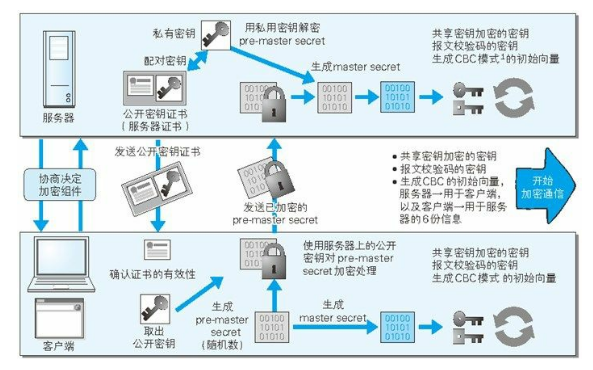
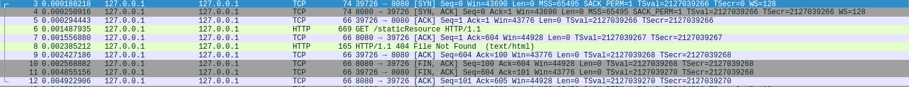

# HTTP协议规范和通信原理

## HTTP协议

下面是通过`httpcomponents-httpclient:4.5.x`发送的一个简单HTTP请求，服务端接收到的请求内容。

```java
request = {BasicHttpRequest@1613} "GET / [Host: localhost:34209, Connection: Keep-Alive, User-Agent: Apache-HttpClient/4.5.13 (Java/1.8.0_252), Accept-Encoding: gzip,deflate]"
 params = null
 method = "GET"
 uri = "/"
 requestline = {BasicRequestLine@1808} "GET / HTTP/1.1"
  protoversion = {HttpVersion@1813} "HTTP/1.1"
  method = "GET"
  uri = "/"
 headergroup = {HeaderGroup@1809} "[Host: localhost:34209, Connection: Keep-Alive, User-Agent: Apache-HttpClient/4.5.13 (Java/1.8.0_252), Accept-Encoding: gzip,deflate]"
  headers = {ArrayList@1826}  size = 4
   0 = {BufferedHeader@1828} "Host: localhost:34209"
   1 = {BufferedHeader@1829} "Connection: Keep-Alive"
   2 = {BufferedHeader@1830} "User-Agent: Apache-HttpClient/4.5.13 (Java/1.8.0_252)"
   3 = {BufferedHeader@1831} "Accept-Encoding: gzip,deflate"
response = {BasicHttpResponse@1614} "HTTP/1.1 200 OK []"
 statusline = {BasicStatusLine@1812} "HTTP/1.1 200 OK"
  protoVersion = {HttpVersion@1813} "HTTP/1.1"
  statusCode = 200
  reasonPhrase = "OK"
 ver = {HttpVersion@1813} "HTTP/1.1"
  protocol = "HTTP"
  major = 1
  minor = 1
 code = 200
 reasonPhrase = "OK"
 entity = null
 reasonCatalog = {EnglishReasonPhraseCatalog@1815} 
 locale = {Locale@1816} "zh_CN"
 headergroup = {HeaderGroup@1817} "[]"
 params = null
context = {HttpCoreContext@1615} 
 context = {BasicHttpContext@1820} "{http.request=GET / [Host: localhost:34209, Connection: Keep-Alive, User-Agent: Apache-HttpClient/4.5.13 (Java/1.8.0_252), Accept-Encoding: gzip,deflate], http.connection=127.0.0.1:34209<->127.0.0.1:56942}"
  parentContext = null
  map = {ConcurrentHashMap@1836}  size = 2
   "http.request" -> {BasicHttpRequest@1613} "GET / [Host: localhost:34209, Connection: Keep-Alive, User-Agent: Apache-HttpClient/4.5.13 (Java/1.8.0_252), Accept-Encoding: gzip,deflate]"
   "http.connection" -> {DefaultBHttpServerConnection@1844} "127.0.0.1:34209<->127.0.0.1:56942"
```


### 协议参数

+ **HTTP版本号**

  HTTP 消息的版本在 HTTP-Version 域被指明,HTTP-Version 域在消息的第一行中。

  HTTP-Version应该只是表示请求行的版本号数据位置，请求中应该不存在这个key。

  对应上面请求内容的`ProtocolVersion`对象。

  ```java
  protected final String protocol;	//eg:"HTTP"
  protected final int major;			//eg:1
  protected final int minor;			//eg:1
  ```

+ **URI & URL**

  ```
  HTTP_URL = "http:" "//" host [ ":" port ] [ abs_path [ "?" query ]]
  ```

  > URI也有长度限制，服务器在依赖大于 255 字节的 URI 时应谨慎,因为一些旧的客户或代理实现可能不支持这些长度。

+ **HTTP时间/日期格式**

+ **字符集**

  通常置于`Content-Type`这个header参数中。

  ```txt
  Content-Type: text/html;charset=utf-8
  ```

+ **内容编码**

  对实体内容编码转换，有`gzip`、`compress`、`deflate`、`identity`（默认,不进行任何编码）。

  在`Content-Encoding`中设置编码格式，不设置此Header参数则按默认处理。

  ```
  Content-Encoding: gzip
  ```

+ **传输编码**

  ```
  Transfer-Encoding:
  ```

+ **块传输编码**

  将消息主体成块发送。一个块有它自己的大小(size)指示器,在所有的块之后会紧接着一个可选的包含实体头域的尾部(trailer)。这种编码允许发送端能动态生成内容,并能携带能让接收端判断消息是否接收完整
  的有用信息。

+ **媒体类型**

  ```
  Content-Type: text/html;charset=utf-8
  Accept: text/html,application/xhtml+xml,application/xml;q=0.9,image/webp,image/apng,*/*;q=0.8,application/signed-exchange;v=b3
  ```

  + 多部分类型

+ **产品标记**
+ **质量标签**
+ **语言标签**
+ **实体标签**
+ **范围单位**

### HTTP消息

+ **消息类型**

  请求消息和响应消息。

  两种类型的消息都由**一个开始行(start-line)**,**零个或更多个头域**(经常被称作“头”),**一个指示头域结束的空行(**也就是以一个 `CRLF` 为前缀的什么也没有的行),最后**一个可有可无的消息主体(message-body)**组成。

+ **消息头**

  详细参考：《图解HTTP》C6 以及 RFC2616 C14。

  + 通用头域（General）

    请求报文和响应报文两方都会使用的首部。

    > Cache-Control 控制缓存的行为，什么原理？
    > Connection 逐跳首部、连接的管理
    > Date 创建报文的日期时间
    > Pragma 报文指令
    > Trailer 报文末端的首部一览
    > Transfer-Encoding 指定报文主体的传输编码方式
    > Upgrade 升级为其他协议
    > Via 代理服务器的相关信息
    > Warning 错误通知

  + 请求头域

    从客户端向服务器端发送请求报文时使用的首部。补充了请求的附加
    内容、客户端信息、响应内容相关优先级等信息。

    > Accept 用户代理可处理的媒体类型
    > Accept-Charset 优先的字符集
    > Accept-Encoding 优先的内容编码
    > Accept-Language 优先的语言(自然语言)
    > Authorization Web认证信息
    > Expect 期待服务器的特定行为
    > From 用户的电子邮箱地址
    > Host 请求资源所在服务器，用于虚拟主机运行在同一个 IP 上使用首部字段 Host 加以
    > 区分
    > If-Match 比较实体标记(ETag)
    > If-Modified-Since 比较资源的更新时间
    > If-None-Match 比较实体标记(与 If-Match 相反)
    > If-Range 资源未更新时发送实体 Byte 的范围请求
    > If-Unmodified-Since 比较资源的更新时间(与If-Modified-Since相反)
    > Max-Forwards 最大传输逐跳数
    > Proxy-Authorization 代理服务器要求客户端的认证信息
    > Range 实体的字节范围请求
    > Referer 对请求中 URI 的原始获取方
    > TE 传输编码的优先级
    > User-Agent HTTP 客户端程序的信息

  + 响应头域

    从服务器端向客户端返回响应报文时使用的首部。补充了响应的附加
    内容,也会要求客户端附加额外的内容信息。

    > ccept-Ranges 是否接受字节范围请求
    > Age 推算资源创建经过时间
    > ETag 资源的匹配信息
    > Location 令客户端重定向至指定URI
    > Proxy-Authenticate 代理服务器对客户端的认证信息
    > Retry-After 对再次发起请求的时机要求
    > Server HTTP服务器的安装信息
    > Vary 代理服务器缓存的管理信息
    > WWW-Authenticate 服务器对客户端的认证信息
    > Allow 资源可支持的HTTP方法
    > Content-Encoding 实体主体适用的编码方式
    > Content-Language 实体主体的自然语言
    > Content-Length 实体主体的大小(单位:字节)
    > Content-Location 替代对应资源的URI
    > Content-MD5 实体主体的报文摘要
    > Content-Range 实体主体的位置范围
    > Content-Type 实体主体的媒体类型
    > Expires 实体主体过期的日期时间
    > Last-Modified 资源的最后修改日期时间

  + 其他首部字段

    > Cookie
    > Set-Cookie
    > Content-Disposition
    > Connection
    > Keep-Alive
    > Proxy-Authenticate
    > Proxy-Authorization
    > Trailer
    > TE
    > Transfer-Encoding
    > Upgrade

+ **消息主体**

+ **消息长度**

+ **常用头域**

### 请求

### 响应

### 实体

### 连接

### 方法定义

### 状态码定义

### 访问认证


### 内容协商

### HTTP缓存

### 安全考虑


## SSL/TLS协议

`HTTPS = HTTP+ 加密 + 认证 + 完整性保护`

使用`HTTPS`, 则`HTTP`部分通信接口会用`SSL`(Secure Socket Layer)和 `TLS`(Transport Layer Security)协议代替。

### 证书工作原理

`HTTPS`通信涉及角色：
用户端、服务端、证书机构。

证书结构：
申请人信息 
域名信息
公钥

两种加密算法
共享密钥加密：加解密都使用相同的密钥处理，速度较快。
公开密钥加密：公钥加密则需要私钥解密，私钥加密则需要公钥解密。私钥一般保存到web服务器，公钥可以公开给任何人。

问题引出：
1）为了保护数据，需要对消息主体加密; 这里采用的是共享密钥加密，这时涉及怎么安全传输共享密钥的问题？
2）为解决密钥传输问题，研发出了非对称加密算法（即公开密钥加密）因为这种算法特性是客户端使用公钥加密传递共享密钥给服务端，只有服务端有私钥可以解密出请求内容（即共享密钥）。不管任何人中间截获加密传输的共享密钥都无法解读就实现安全传输共享密钥问题。
3）客户端的共享密钥成功传输给服务端后，服务端响应数据就是通过这个共享密钥加密。不过上面还有问题（怎么确定连的就是目标服务器）：万一有服务器伪装成目标服务器，发了个假公钥过来，客户端通过假公钥把共享密钥加密后发给假冒的服务器后，不就泄漏了？
4）针对上面问题，就需要有一个可以信任的服务器作为公证人（证书机构服务器），保存目标服务器的公钥。任何人从公证人那里获取的公钥都是可信的（公钥和域名、申请人信息一起保存为证书）。但是公证人如何确保是可信任的不是伪造的？就涉及证明公证人身份的校验。
5）为了确认公证人可信，多数浏览器开发商都会事先在内部植入常用认证人（认证机构）的证书（根证书）。客户端发请求给认证机构服务器请证明你的身份，如果是可信的认证机构客户端会收到一个私钥加密的信息，可以用根证书中的公钥解密成功，否则解密失败。
6）解密成功后，认证机构服务器可信，然后通过认证机构公钥请求目标服务器的证书，认证机构会将目标服务器的包含公钥的可信任的证书送达。然后目标服务器公钥可信 -> 目标服务器响应可信 -> 可传输共享密钥 -> 可安全通信。

证书使用（以`HTTPS`请求为例，个人理解，里面还有不严谨的地方）：
0）某某网站从本地根证书查到认证机构服务器地址请求核查对方身份（就是用对方的公钥解密对方身份信息），成功后将自己的公钥发给认证机构请求对方颁发证书，对方审查完毕会颁发证书给某某网站，并加入自己的证书数据库。
1）客户端获取某某网站证书，然后查本地根证书，获取获取认证机构服务器地址和公钥，给此地址发送请求让对方证明身份（防`DNS`欺骗）对方发一个用私钥加密的数据，客户端可以用本地根证书公钥解密成功说明认证机构可信；
2）将某某网站的证书发给认证机构校验签名以确认真实性。
3）客户端确认某某网站证书（包含公钥）有效后，请求某某网站身份校验（使用公钥加密请求传输账户名密码及共享密钥）某某网站如果是真实的则会发送使用私钥加密的认证结果，客户端可以使用公钥成功解密认证结果获取连接token。
4）解析成功且身份认证正确后，客户端就使用共享密钥加密包含token和请求参数的消息主体与服务端通信。



### 证书签发

根证书签发（就是添加可信任的认证机构）。
1）使用openssl（ssl协议的一种实现）签发根证书
2）使用cfssl签发根证书
3）调用ssl库的API进行签发根证书

链证书签发（使用根证书或根证书签发的中间证书签发，就是添加可以信任的网站）。

[CFSSL下载](https://pkg.cfssl.org/)

`cfssl` 主配置 `config.json`

```json
{
  "signing": {
    "default": {
      "expiry": "43800h"
    },
    "profiles": {
      "peer": {
        "expiry": "43800h",
        "usages": [
          "signing",
          "key encipherment",
          "server auth",
          "client auth"
        ]
      },
      "server": {
        "expiry": "43800h",
        "usages": [
          "signing",
          "key encipherment",
          "server auth"
        ]
      },
      "client": {
        "expiry": "43800h",
        "usages": [
          "signing",
          "key encipherment",
          "client auth"
        ]
      }
    }
  }
}
```

生成根证书配置 `ca-csr.json`
```json
{
  "CN": "demo",
  "hosts": [],
  "key": {
    "algo": "rsa",
    "size": 2048
  },
  "names": [
    {
      "C": "CN",
      "ST": "Guangdong",
      "L": "Shenzhen",
      "O": "demo",
      "OU": "System"
    }
  ]
}
```

生成根证书
```sh
cfssl gencert -initca ca-csr.json | cfssljson -bare ca
cfssl-certinfo -cert ca.pem
```

生成链证书配置 `localhost-csr.json`
```json
{
  "CN": "localhost",
  "hosts": [
    "localhost",
    "127.0.0.1"
  ],
  "key": {
    "algo": "rsa",
    "size": 2048
  },
  "names": [
    {
      "C": "CN",
      "ST": "Guangdong",
      "L": "Shenzhen",
      "O": "localhost",
      "OU": "System"
    }
  ]
}
```

生成链证书
```sh
cfssl gencert \
  -ca=./ca.pem \
  -ca-key=./ca-key.pem \
  -config=./config.json \
  -profile=peer \
  localhost-csr.json | cfssljson -bare localhost
cfssl-certinfo -cert localhost.pem
```


## HTTP通信流程原理

首先使用抓包工具`WireShark`看下网络连接过程(`Loopback:Io(port8080)`)：



显示经历３次握手然后客户端给服务端发`HTTP Get`请求，然后服务端返回确认收到请求`Ack`,然后返回处理结果，最后是４次分手。

> `WireShark`适用于`TCP`/`UDP`/`HTTP`抓包。
>
> `Charles`适用于`HTTP`/`HTTPS`抓包。


## 附录

+ 参考资料
  + [Hypertext Transfer Protocol -- HTTP/1.1](https://www.rfc-editor.org/info/rfc2616) 
  + [The Secure Sockets Layer (SSL) Protocol Version 3.0](https://tools.ietf.org/html/rfc6101)
  + 《图解HTTP》