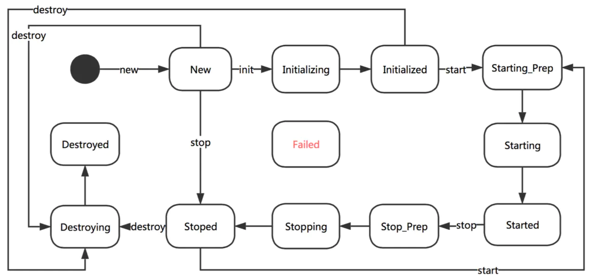
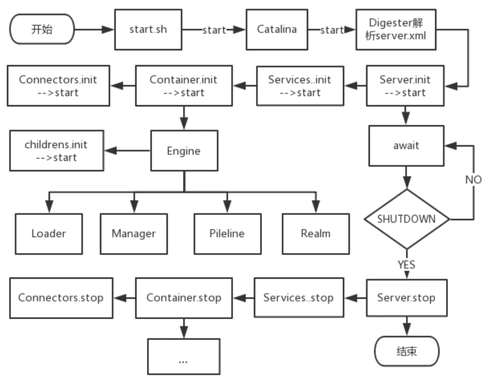
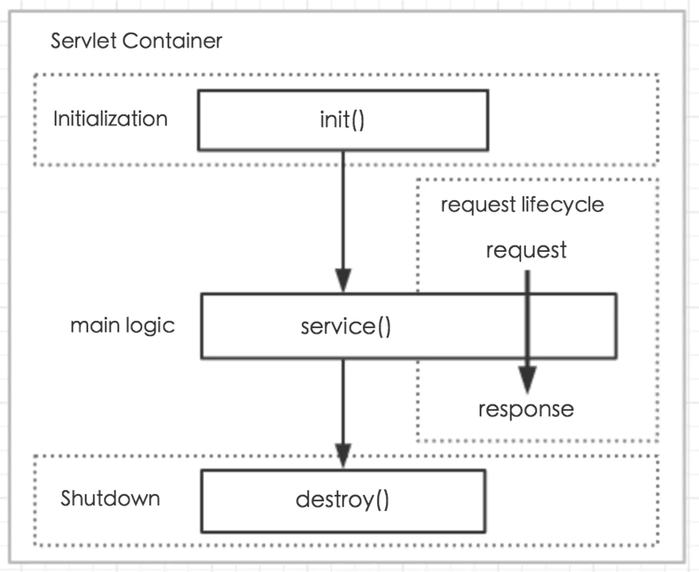

# Tomcat工作原理

## Tomcat核心功能

Tomcat最核心的东西就是建立Socket连接，读请求报文输入流，根据请求内容进行处理，处理后写响应报文输出流。

核心功能示例：`tomcat01.socket`。

**要做的三件事**：

+ 创建`request`对象，填充请求的参数、头部、cookies、查询字符串、URI等等。

  实现`javax.servlet.ServletRequest` 或 `javax.servlet.http.ServletRequest `接口。

+ 创建response对象，用于将响应发送回客户端。

  实现`javax.servlet.ServletResponse` 或`javax.servlet.http.ServletResponse`接口。

+ 调用`servlet`的`service`方法，并传入`request`和`response`对象，从`request`对象取值，处理，写入`response`对象。

然后就是围绕着这个将通用的逻辑模块化(如：连接器`Connector`、各级容器[Service、Engine、Host、Context、Wrapper、)，将变化的部分抽离出来（如：`Servlet`、配置）。

**设计流程**：

**设计流程**：

1. **Socket实现处理`HTTP`请求**

2. **引入`Servlet`接口规范；将业务逻辑抽离到`Servlet`**
   StandardWrapper 实现了 Wrapper 接口的 load 方法, load 方法调用 loadServlet
   方法来加载一个 servlet 类,并调用该 servlet 的 init 方法,传递一个
   javax.servlet.ServletConfig 实例。这里是 loadServlet 是如何工作的。
   方法 loadServlet 首先检查 StandardWrapper 是否表示一个 STM servlet。如果
   不是并且该实例不是 null(即以前已经加载过),直接返回该实例:
   // Nothing to do if we already have an instance or an instance pool
   if (!singleThreadModel && (instance != null))
   return instance;
   如果该实例是 null 或者是一个 STM servlet,继续该方法的其它部分:.

3. **引入连接器`Connector`（接收`HTTP`连接请求,并分发给`Container`处理）**

   `Connnector`控制连接数量，数据缓冲大小，记录每个连接的基本信息（`IP地址`）。

   `Connector`中有一个处理器集合

   线程池

   `ServerSocketFactory`

   `LifecycleSupport`

   代理

   `DNS`

   `Service`

4. **引入容器`Wrapper`和`Context`（存储`Servlet`, 使用`Pipeline`.`Valve`做预处理）**

   容器用于存储`Servlet`业务处理组件。

   `Pipeline`: 是包含`basicValve`在内的Valve集合。`basicValve`是最后一个`Valve`，通过它对接到`Servlet`实例进行业务处理。

   `Valve`：是做请求预处理的。
   如：记录一下请求日志：`HeaderLoggerValve`、`ClientIPLoggerValve`、

   `Wrapper`和`Context`区别和关系：
   `Wrapper`包含`Servlet`实例，
   `Context`则使用`Map`存储`Wrapper`, 还包含`servletMappings`存储请求和处理的映射关系。
   `Mapper`

5. **引入生命周期管理**

6. **拓展组件**

   自定义类加载器

   Server、Service、Engine、Host。

7. **引入日志组件**

8. **优化措施**

   Degester实现XML软编码配置

   关闭钩子

   部署器

   Servlet管理

## Tomcat架构和组件


**核心组件：**

+ **Connector**

    连接器是用来“连接”请求和Servlet容器的，为接收到每一个 HTTP 请求构造一个 request 和 response 对象。

    容器从连接器接收到 requset 和 response 对象之后调用 servlet 的 service 方法用于响应。

+ **Server**(不算核心组件)

    Tomcat包启动在某个端口上的服务实例。一台物理服务器可以启动多个`Server`在不同的端口上。

    负责管理和启动各个Service，同时监听 8005 端口发过来的 shutdown 命令，可以优雅地启动和关闭整个容器 ；

+ **Service**(不算核心组件)

     包含 Connectors、Container(只有一个) 两个核心组件，以及多个功能组件。

+ Container

  容器（Container）主要包括四种，Engine、Host、Context和Wrapper。

  + **Engine**

    Servlet 的顶层容器，包含一个或多个 Host 子容器，

    主要职责为：使用默认的基础Valve创建标准Engine组件。

  + **Host**

    虚拟主机。一个Host通常对应一个IP、域名，有独立的资源路径，如webapps。

    负责 web 应用的部署和 Context 的创建。

    通过Host可以支持部署多个Web应用（比如app1、app2、...）。

    比如一个Tomcat要支持多个域名。

    ```xml
    <Host name="www.ramki.com" appbase="ramki_webapps" />
    ```

  + **Context**

    叫做上下文容器，每个Host里面可以运行多个应用服务app1, app2, ...。同一个Host里面不同的Context，其contextPath必须不同，默认Context的contextPath为空格("")或斜杠(/)。

  + **Wrapper**

    Servlet的抽象和包装，每个Context可以有多个Wrapper，用于支持不同的Servlet。另外，每个JSP其实也是一个个的Servlet。

  容器中为何要引入这么多种容器类型？

  个人认为为了支持分门别类地放更多的`Servlet`。比如图书馆，存书时是把书直接堆在一起还是按大类分馆，按中间类分楼层，按小类分室，按细分类分架。类分地越细，某一类的通用处理就越容易。

**组件的关系**：

`ex14.pyrmont`:

```java
Connector connector = new HttpConnector();

Wrapper wrapper1 = new StandardWrapper();					//wrapper
wrapper1.setName("Primitive");
wrapper1.setServletClass("PrimitiveServlet");	//wrapper包装Servlet
Wrapper wrapper2 = new StandardWrapper();
wrapper2.setName("Modern");
wrapper2.setServletClass("ModernServlet");

Context context = new StandardContext();							//context
context.setPath("/app1");
context.setDocBase("app1");
context.addChild(wrapper1);		//context包装wrapper
context.addChild(wrapper2);

Host host = new StandardHost();                                  				//Host
host.addChild(context);				//context加入host
host.setName("localhost");		//指定域名
host.setAppBase("webapps");//指定资源路径

Loader loader = new WebappLoader();	//Servlet类加载器
context.setLoader(loader);
context.addServletMapping("/Primitive", "Primitive");	//路由映射
context.addServletMapping("/Modern", "Modern");

Engine engine = new StandardEngine();                                 //engine
engine.addChild(host);
engine.setDefaultHost("localhost");		//host加入到engine

Service service = new StandardService();                              //service
service.setName("Stand-alone Service");
service.addConnector(connector);
service.setContainer(engine);				//将engine设置为service的容器，一个Service只有一个Engine容器

Server server = new StandardServer();                                 	//Server
server.addService(service);						//service加入到server中
```

**辅助组件：**

+ **listener**

  实现生命周期管理。

+ **Resource/ResourceLink**

  定义`Servlet`等资源的。

+ **Realm**

  安全认证相关控制。

  可以在这里面添加BASIC、DEGEST、FORM等等用户认证实现。

+ **Loader**

  Servlet类加载器。

+ JNDI

+ Cluster

+ Manager

  管理Servlet的。

## 生命周期管理

这部分是最重要的。

Catalina启动的时候，组件同步启动；关闭的时候组件同步关闭。如容器停止的时候要唤醒所有加载的`Servlet`的`destory`方法，`session`管理器保存session到二级存储器。

关注内容：

+ 生命周期管理的目的

  为了方便管理组件和容器的创建和销毁。

+ 事件类型

  启动前、启动中、启动后，关闭前、关闭中、关闭后。（新版本定义了从创建、启动、到停止、销毁共 12 种状态）。

+ 根组件到子孙组件生命周期是如何同步管理的

这部分代码基于`观察者模式`。

### 生命周期管理流程

`Tocmat`的子组件的生命周期通过父组件管理（*父组件包含子组件的引用，组件都实现`Lifecycle`接口，通过`start()`和`stop()`方法启动和关闭，所以父组件关闭的时候会先通过子组件的引用调用`Lifecycle`接口关闭子组件）。



+ 接口

  + `Lifecycle`

    启动、关闭、增删监视器、查找监视器。

  + `LifecycleListener`

    定义生命周期监听器的方法，生命周期监听器其实就是各个组件（如：`Context`, `Wrapper`,`Valve`等）。

  + `LifecycleEvent`

    生命周期事件， 定义前面说的6种事件类型。

+ 实现

  + `LifecycleSupport`

    生命周期管理的实现类（是`LifecycleListener`的容器），包括添加、查找、删除监听器，触发生命周期事件等方法。

    实现`Lifecycle`接口的组件可以通过添加`LifecycleSupport`成员变量，实现管理生命周期。

    如第6章的`SimpleContext`(根组件)包含一个`LifecycleSupport`的实例, 实现`Lifecycle`的`start()`和`stop()`方法, `start()`先`fireLifecycleEvent()`然后获取所有子容器依次启动它们的`start()`的方法，而它的子容器也是这么处理孙子容器的，从而只需要启动根容器就可以启动下面所有子子孙孙容器。

    如果子孙容器启动异常，会抛出`LifecycleException`, 触发关闭相关事件，执行关闭处理。

+ 实例

  示例代码：`ex06.pyrmont`

  这个示例中`SimpleContext`实例`context`为根容器，添加了两个`SimpleWrapper`子容器，分别处理路由`/Primitive`和`/Modern`（具体路由规则看`SimpleContextMapper`），根容器在`HttpConnector`启动后启动。

  ```java
  //main
  Context context = new SimpleContext();
  LifecycleListener listener = new SimpleContextLifecycleListener();
  ((Lifecycle) context).addLifecycleListener(listener);
  
  //容器启动生命周期管理
  ((Lifecycle) context).start();
  	//SimpleContext.start()
  	lifecycle.fireLifecycleEvent(BEFORE_START_EVENT, null);
  		//LifecycleSupport
  		LifecycleEvent event = new LifecycleEvent(lifecycle, type, data);
  		interested[i].lifecycleEvent(event);	//interesterd中存储着前面添加的SimpleContextLifecycleListener实例，lifecycleEvent()是监听器回调方法。
  	started = true;	//设置下标志位表示此容器已经启动
  	//后面是启动其他实现Lifecycle的组件（包括pipeline、子容器、...）
  	if ((loader != null) && (loader instanceof Lifecycle))
          ((Lifecycle) loader).start();
  	Container children[] = findChildren();
      for (int i = 0; i < children.length; i++) {
          if (children[i] instanceof Lifecycle)
              ((Lifecycle) children[i]).start();
      }
  	if (pipeline instanceof Lifecycle)
          ((Lifecycle) pipeline).start();
  
      lifecycle.fireLifecycleEvent(START_EVENT, null);
  
  	lifecycle.fireLifecycleEvent(AFTER_START_EVENT, null);
  
  //容器关闭生命周期管理
  ((Lifecycle) context).stop() //代码流程和启动流程几乎一样，只是一个开一个关
  ```

  

### Tomcat启动流程

其实主要就是上面的生命周期管理流程。



### `Servlet`生命周期



## 请求处理流程

**Tomcat的端口：**

+ 8005

  关闭控制端口，监听关闭命令。

+ 8009

  集群通信端口，与其他服务器通信，如与Apache、Nginx、其他Tomcat服务器通信，基于AJP协议，可用于请求转发。

+ 8080

  默认的http监听端口。

+ 8443

  默认的https监听端口。

**Tomcat Server处理http请求的过程:**


**示例**：

`ex11.pyrmont`

1.连接器创建request和response对象；

2.连接器调用 StandarContext实例的invoke()方法;

3.接着，StandarContext实例的invoke()方法调用其他管道对象的invoke()方法。StandardContext中管道对象的基础阀是StandardContextValve实例，因此，StandardContext的管道对象会调用StandardContextValve实例的invoke()方法；

4.StandardContextValve实例的invoke()方法获取相应的Wrapper实例处理Http请求，调用Wrapper实例的invoke()方法；

5.StandardWraper是Wrapper接口的标准实现，StandardWraper实例的invoke()方法会调用其管道对象的invoke()方法；

6.StandardWraper的管道对象中的基础阀是StandardWraperValve实例，因此，会调用StandardWraperValve的invoke()方法，StandardWraperValve的invoke()方法调用warpper实例的allocate()方法获取Servlet实例；

7.allocate()方法调用load()方法载入相应的Servlet类，若已经载入，则无需重复载入；

8.load()方法调用Servlet实例的init()方法；

9.获取过滤器链，并遍历处理；

10.StandardWrapperValve调用Servlet实例的Servlet的service()方法。

## 连接器`NIO2`多路复用模型

## Session处理

## `JSP`引擎

## 容器优化

##　整体优化


## 设计最简单的Web服务器

设计一个简单的Web服务器实现前面说的三件事。

首先需要补习一下HTTP（超文本传输协议）的原理和规范（后面在《HTTP协议规范和通信原理.md》中深入总结）：

+ HTTP请求/响应组成

+ HTTP协议族

+ 基于HTTP协议通信原理

+ TCP/IP通信原理与Socket套接字接口

  从常见的涉及通信的框架底层实现一般都会看到Socket。
  
  处理请求的Socket默认实现类SocksSocketImpl（即使是http请求，在传输层看来也是TCP包）。
  
  而Socket里面有一个FileDescriptor的东西，应该就是对应网络底层设备的“文件”了。
  
  FileDescriptor又被NIO包装了一次。但是数据传输都是通过FileDescriptor。
  
  ```java
  //获取输入输出流
  Socket::getInputStream()
  Socket::getOutputStream()
  ```

最简Web服务器工作流程：

１）创建ServerSocket,并启动8080监听连接accept();

２）有连接(Socket)接入获取输入流getInputStream();读取read()请求处理；

下面已经是经过层层解包，获取的请求报文了。

```txt
GET /staticResource HTTP/1.1
User-Agent: PostmanRuntime/7.22.0
Accept: */*
Cache-Control: no-cache
Postman-Token: 402ed828-5846-44d2-ad7b-2dcee3d89d42
Host: localhost:8080
Accept-Encoding: gzip, deflate, br
Connection: keep-alive
```

３）获取输出流getOutputStream()，将请求处理结果写入write()到输出流；

```java
//这里报文就是一串HTTP Response字符串，没有引入HTTP协议处理（HTTP协议处理的结果也就是这么一串字符串？）
String errorMessage = "HTTP/1.1 404 File Not Found\r\n" +
    "Content-Type: text/html\r\n" +
    "Content-Length: 23\r\n" +
    "\r\n" +
    "<h1>File Not Found</h1>";
output.write(errorMessage.getBytes());
```

之后经过层层封包经过物理层传输出去。

４）关闭Socket连接close()。


## 设计简单的Servlet容器

### 核心类(规范)

+ **ServletRequest**

  定义请求的接口，核心包括`输入流`以及读取输入流后获取`请求报文内容`的方法；

  **读输入流->解析请求报文**

+ **ServletResponse**

  定义回复的接口，核心包括`输出流`以及设置`回复报文内容`的方法

  **构造回复报文->写输出流**

  里面还为输出流封装了一个接口Writer.

+ **Servlet**

  前面的类封装了那些比较固定操作，如流读写、报文内容获取或构造；所有的请求的这些操作都是一样的；

  而**Servlet则定义哪些不同的业务流程**，比如商品服务获取商品信息，订单服务下订单等。

  > Servlet 类似多线程的Task, Servlet容器类似多线程的ThreadPoolExecutor

+ **ServletConfig**

### Java.net

+ **URL**

  URL是URI的子集, URI = URL + URN(基本没什么应用); 

  统一资源定位符类;指向www上的某个资源;

  资源可以是文件(文档/图片/视频)/目录/服务(数据库查询)/指向搜索引擎(?)等等;

  ```shell
  # URL的格式
  # URL的第一部分是URL协议，第二部分是服务器的位置，第三部分是资源路径。
  <scheme>://<user>:<password>@<host>:<port>/<path>;<params>?<query>#<frag>
  # 协议方案名      登录信息      服务器地址/端口 资源文件路径 参数 查询字符串 片段标识符 
  # TODO:第三部分定位资源的原理?
  # 示例
  ftp://ftp.is.co.za/rfc/rfc1808.txt
  http://www.ietf.org/rfc/rfc2396.txt
  ldap://[2001:db8::7]/c=GB?objectClass?one
  mailto:John.Doe@example.com
  news:comp.infosystems.www.servers.unix
  tel:+1-816-555-1212
  telnet://192.0.2.16:80/
  urn:oasis:names:specification:docbook:dtd:xml:4.1.2
  ```

  URL支持的协议: http/ftp/file/mailto/telnet/...;

  URL类的数据结构也正是对应着上面`<scheme>://<user>:<password>@<host>:<port>/<path>;<params>?<query>#<frag>`。

+ **URLClassLoader**

  通过URL定位Class资源，然后进行加载。支持从文件目录加载、从Jar包加载、从Http远程加载。

  

## 引入连接器

连接器就是一个Socket服务线程，监听连接请求。并将建立的连接（Socket）交给一个新建的Processor处理（即每建立一个Socket连接都要新建一个Processor处理）。

### Tomcat默认连接器

HttpConnector是Tomcat早期版本的默认连接器。

#### Bootstrap的职责

+ **创建HttpConnector**

  接收请求并分发的核心逻辑。

  几个核心成员：

  Container: Servlet的容器;

  Vector: HttpProcessor的集合;

  Stack: HttpProcessor可用（空闲的）集合;

  ServerSocketFactory: 创建ServerSocket的工厂;

  LifecycleSupport: 生命周期管理器;

  > 从上面几个核心成员就可以知道HttpConnector的工作：
  >
  > 创建ServerSocket监听请求，创建HttpProcessor用于分发处理请求？？？

+ **创建HttpContainer,并传参绑定到HttpConnector**

+ **启动独立的线程执行HttpConnector的run()方法**

+ **使用System.in.read()方式使主线程阻塞**

  至此一共创建了1个HttpConnector请求连接线程和5个HttpProcessor请求处理线程。

#### HttpConnector的职责

+ **通过工厂模式创建ServerSocket**

  DefaultServerSocketFactory (里面就是直接new java.net.ServerSocket)

  ServerSocketFactory, 定义通用接口（可指定端口port、连接数量backlog[存货的意思]、IP地址）

  Socket请求在一个while循环中监听，接到请求后选出一个可用的HttpProcessor处理。

+ **创建HttpProcessor, 处理请求**

  这里面类似线程池的实现。从池中pop一个空闲的HttpProcessor处理当前Socket连接，没有则创建，

  如果超出最大数量限制则返回null.

  HttpProcessor中定义一些通用的处理，比如：请求解析（请求头、请求行、请求体）;

  将InputStream和OutputStream包装请求HttpServletRequest和回复HttpServletResponse;

  然后交给Container容器，由具体匹配到的Servlet进行处理。

  > 为什么要将请求封装成HttpServletRequest和HttpServeltResponse?
  >
  > 为了在Servlet中读请求行、请求头以及写回复等更方便。parseConnection() 和 parseRequest()方法，帮我们将一些重要的请求信息从请求报文字符串中提取出来，并以成员变量的方式填入HttpServletRequest和HttpServletResponse, 在Servlet中需要用到这些信息时就只需要通过getter方法获取即可。

+ **生命周期管理（其实就是基于事件监听模式, 生命周期管理后面详细说）**

  生命周期内有多个**事件**，每个事件会创建一个生命周期**事件监听回调方法**。

  LifecycleSupport（就是被管理的对象[即HttpConnector]和一组生命周期事件监听回调方法）

  Lifecycle: 定义web服务器的生命周期事件（start/before_start/after_start/stop/before_stop/after_stop）

  LifecycleListener: 生命周期事件监听回调接口

> 每个HttpConnector在一个独立的线程中执行。
>
> HttpProcessor是以Vector和Stack的方式存储（最少5个常驻的，最多20个，即15个临时工）。
>
> 每个HttpProcesor实例也是在一个独立的线程中执行。没有任务处理时wait(), 有任务时被唤醒。

### 附录

+ ResouceBundle

  用于资源包加载，实现国际化的类。

  

## 将处理封装成容器

`HttpConnector`将请求封装一下交给容器中的`Servlet`执行真正的业务处理。

**Container接口最核心方法**：

```java
invoke(Request, Response):void		//调用Servlet service()方法
```

**容器的职责**：

+ 解析`HttpServletRequest`中请求路由信息，匹配使用哪个`Servlet`处理;
+ 加载`Servlet`类，调用`Servlet`类处理，将结果写入`HttpServletResponse`;

### Tomcat容器

Tomcat的容器新引入了几个概念：之前的Container加了多个实现：Engine、Host、Context、Wrapper。


### 核心类

+ **Wrapper**

+ **Pipeline**

  描述需要在invoke()方法被调用前被顺序执行的Valves集合。

+ **Valve**

  中文意为“阀门”，跟过滤器一样,一个阀门可以操作传递给它的 request 和 response 方法。让一个阀门完成了处理,则进一步处理流水线中的下一个阀门,基本阀门总是在最后才被调用。

  之前执行`HttpProcessor（Container）`的`invoke`方法直接就是获取从Socket读输入流处理写输出流，现在变成

+ **ValveContext**

+ **Contained**

  

## 容器优化

### 容器内`Servlet`类的动态加载

因为**安全性**等方面的原因无法使用Java默认的加载器加载，需要特殊定制加载器。

Tomcat需要自定义类加载器原因：

+ 要制定类加载器的某些特定规则

  例如,在一个应用程序中 `Servlet` 可以使用部署到 WEB-INF/classes 目录和任何子目录下面的类。
  然而,没有`servlet`的不能访问其他类,即使这些类是在运行 Tomcat 所在的 `JVM` 的 `CLASSPATH` 中。此外,一个 `servlet` 只能访问 WEB-INF/lib 目录下的类库,而不能访问其他目录下面的。

+ 缓存以前加载的类

  TODO

+ 事先加载类以预备使用

  TODO

[tomcat为什么要自定义三个类加载器](https://blog.csdn.net/qq_45451805/article/details/105121945)

Tomcat类库：`WEB-INF/classes` `WEB-INF/lib`。

加载器需要实现从指定目录（如）加载

#### `Servlet`类加载流程

+ 接口
  + `org.apache.catalina.Loader`
  + `org.apache.catalina.loader.Reloader`

+ 实现

  + `WebappLoader`

    创建类加载器、设置类库、设置`classpath`、设置权限、开启新的线程用于重新加载。

+ 实例

  `ex08.pyrmont`

  ```java
  Loader loader = new WebappLoader();
  context.setLoader(loader);
  WebappClassLoader classLoader = (WebappClassLoader) loader.getClassLoader();
  
  ```

  

### Session会话引入（有状态引入）与管理

#### Session会话的生成保存与cookie在前后端的协作原理

### 访问安全控制

### 容器细化分类设计

#### Wrapper

#### Context

##### 部署器原理

##### Servlet管理器

##### JMX-Based Management

#### Host & Engine

### 引入Server服务器组件

用于优雅地管理连接器和Servlet容器启动关闭，而不需要再一个个地启动和关闭连接器和容器了。

#### Tomcat启动/关闭流程

##### Linux/Unix启动脚本


## 参考资料

《How Tomcat Works》

[深入理解Tomcat](https://www.jianshu.com/nb/30714822)

[Tomcat组成与工作原理](https://juejin.im/post/6844903473482317837)

